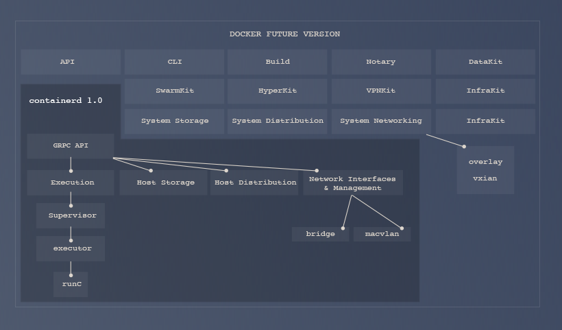

[containerd](https://containerd.io/) 是为了兼容OCI标准而从Docker中拆分出来专门负责镜像管理和容器执行的组件。它向上对Docker提供gRPC接口，向下借助containerd-shim使用runc运行和管理容器。这样带来的好处包括

* 最重要的可以在docker或者containerd重启的时候container还保持running
* container runtime pluggable，比如除了runc可以选择用runV或clear container等
* 性能，新的containerd没有历史包袱，一开始就针对性能做了优化
* docker daemon的角色变化，docker只需要做少量的准备工作，把真正运行容器的工作交给containerd：
  - Image management
  - Generate OCI bundle for containers
  - Mount the container’s root filesystem inside the bundle
  - Call containerd to start container


## containerd架构

架构组成


组件结构


在docker中的角色和功能



## 安装

```sh
wget https://github.com/containerd/containerd/releases/download/v1.0.0-beta.0/containerd-1.0.0-beta.0.linux-amd64.tar.gz
tar zxvf containerd-1.0.0-beta.0.linux-amd64.tar.gz -C /usr/local
curl -sSL https://raw.githubusercontent.com/containerd/containerd/master/containerd.service -o /lib/systemd/system/containerd.service

systemctl daemon-reload
systemctl start containerd
```

## 使用示例

containerd提供了一个`ctr`命令行工具，用来跟containerd进程交互。

```sh
ctr pull docker.io/library/redis:latest
ctr images list

ctr run docker.io/library/redis:latest containerd-redis
ctr containers
```

当然，也可以通过containerd的gRPC接口来管理镜像和容器，具体使用方法可以参考[这里](https://github.com/containerd/containerd/blob/master/docs/getting-started.md)。