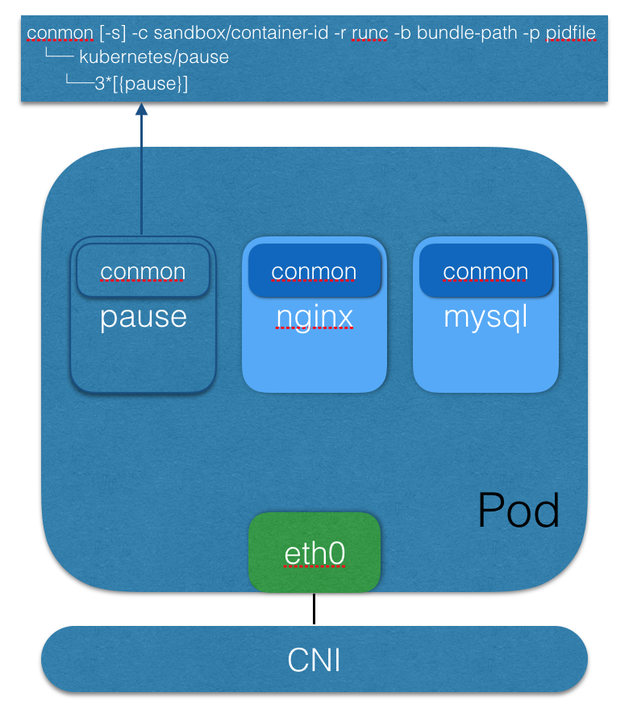
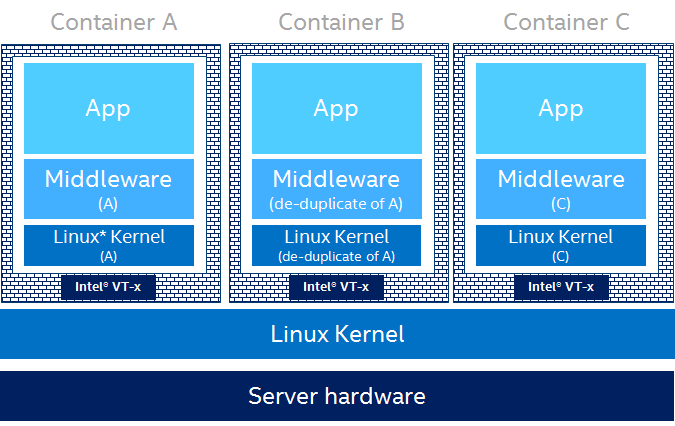
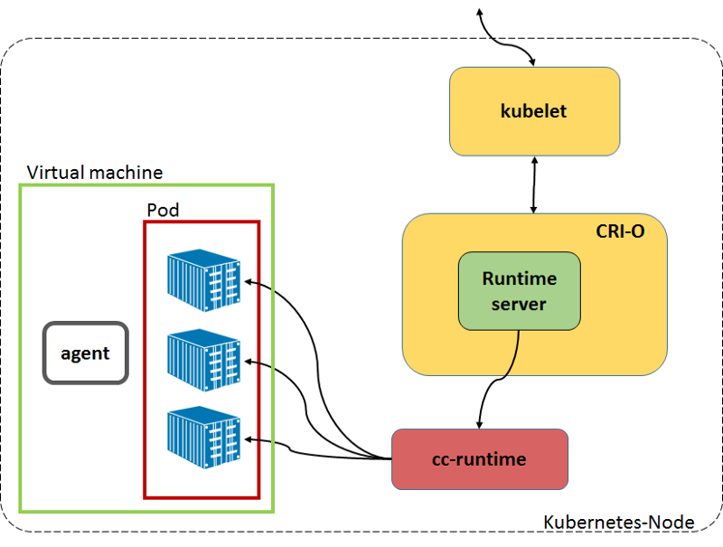

# cri-o

cri-o基于Kubelet容器运行时接口（CRI）为Kubernetes带来了原生的OCI运行时(目前仅支持runc)。cri-o还在紧张有序的开发中，预计与Kubernetes v1.5一起发布第一个alpha版本。

## cri-o原理

主要组成


Pod结构



conmon


## 编译安装

```sh
# CentOS/Fedora
# yum install -y btrfs-progs-devel device-mapper-devel glib2-devel glibc-devel glibc-static gpgme-devel libassuan-devel libgpg-error-devel libseccomp-devel libselinux-devel ostree-devel pkgconfig runc
# Ubuntu
apt-get install -y linux-headers-$(uname -r) build-essential
apt-get install -y btrfs-tools libassuan-dev libdevmapper-dev libglib2.0-dev libc6-dev libgpgme11-dev libgpg-error-dev libseccomp-dev libselinux1-dev pkg-config runc libapparmor-dev

# get and build cri-o
mkdir -p $GOPATH/src/github.com/kubernetes-incubator
cd $_ # or cd $GOPATH/src/github.com/kubernetes-incubator
git clone https://github.com/kubernetes-incubator/cri-o # or your fork
cd cri-o
make install.tools
make
sudo make install
make install.config
```

安装CNI：

```sh
# get cni
go get -d github.com/containernetworking/plugins
cd $GOPATH/src/github.com/containernetworking/plugins
./build.sh

# build and install
sudo mkdir -p /opt/cni/bin
sudo cp bin/* /opt/cni/bin/

# config cni
sudo mkdir -p /etc/cni/net.d
sudo sh -c 'cat >/etc/cni/net.d/10-mynet.conf <<-EOF
{
    "cniVersion": "0.2.0",
    "name": "mynet",
    "type": "bridge",
    "bridge": "cni0",
    "isGateway": true,
    "ipMasq": true,
    "ipam": {
        "type": "host-local",
        "subnet": "10.88.0.0/16",
        "routes": [
            { "dst": "0.0.0.0/0"  }
        ]
    }
}
EOF'
sudo sh -c 'cat >/etc/cni/net.d/99-loopback.conf <<-EOF
{
    "cniVersion": "0.2.0",
    "type": "loopback"
}
EOF'
```

启动cri-o

```sh
sudo sh -c 'echo "[Unit]
Description=OCI-based implementation of Kubernetes Container Runtime Interface
Documentation=https://github.com/kubernetes-incubator/cri-o

[Service]
ExecStart=/usr/local/bin/crio --debug
Restart=on-failure
RestartSec=5

[Install]
WantedBy=multi-user.target" > /etc/systemd/system/crio.service'
sudo systemctl daemon-reload
sudo systemctl enable crio
sudo systemctl start crio
```

## cri-o单独使用

```sh
cd $GOPATH/src/github.com/kubernetes-incubator/cri-o
# create sandbox
POD_ID=$(sudo crioctl pod run --config test/testdata/sandbox_config.json)
sudo crioctl pod status --id $POD_ID

# create container
sudo crioctl image pull redis:alpine
CONTAINER_ID=$(sudo crioctl ctr create --pod $POD_ID --config test/testdata/container_redis.json)
sudo crioctl ctr start --id $CONTAINER_ID
sudo crioctl ctr status --id $CONTAINER_ID

# stop and remove
sudo crioctl ctr stop --id $CONTAINER_ID
sudo crioctl ctr remove --id $CONTAINER_ID
sudo crioctl pod stop --id $POD_ID
sudo crioctl pod remove --id $POD_ID
```

启动一个redis容器后的进程关系：

```
 ├─crio ExecReload=/bin/kill -s HUP
  │   ├─conmon -c default-podsandbox1-0-infra -r /usr/local/sbin/runc
  │   │   └─pause
  │   ├─conmon -c default-podsandbox1-0-podsandbox1-redis-0 -r /usr/local/sbin/runc
  │   │   └─redis-server
  │   │       └─2*[{redis-server}]
  │   └─9*[{crio}]
```

```
      ├─13009 crio --runtime /usr/sbin/runc --debug
      ├─13049 /usr/libexec/crio/conmon -c default-podsandbox1-0-infra -r /usr/sbin/runc
      ├─16081 /usr/libexec/crio/conmon -c default-podsandbox1-0-podsandbox1-redis-0 -r /usr/sbin/runc
      ├─podsandbox1.slice:container:infra
      │ └─13058 /pause
      └─default-podsandbox1-0-podsandbox1-redis-0
        └─16090 redis-server *:6379
```

## Kubernetes cri-o

```sh
CONTAINER_RUNTIME=remote CONTAINER_RUNTIME_ENDPOINT='/var/run/crio.sock --runtime-request-timeout=15m' ./hack/local-up-cluster.sh
```

## Clear Container

Intel [Clear Container](https://github.com/clearcontainers/runtime) 是一个OCI标准的容器引擎，它将容器运行在基于Intel VT-x的虚拟机中，并通过KSM内存共享、mini-OS等方法加快启动速度。



Clear Container支持在dockerd中运行，配置方法为

```sh
dockerd  -— add-runtime cc-runtime=/usr/bin/cc-runtime - — default-runtime=cc-runtime
```

它也支持通过cri-o来管理Kubernetes容器，配置时只需要修改crio的配置`/etc/crio/crio.conf`为

```
runtime_untrusted_workload = "/usr/local/bin/cc-runtime"
default_workload_trust = "untrusted"
```



## 参考文档

- <https://github.com/kubernetes-incubator/cri-o>
- <https://github.com/clearcontainers/runtime>
- [Intel® Clear Containers and CRI-O](https://medium.com/cri-o/intel-clear-containers-and-cri-o-70824fb51811)
